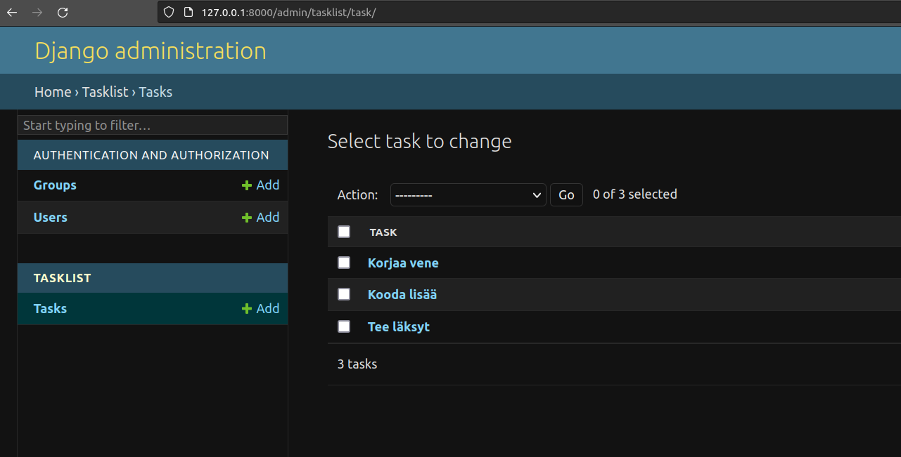

# Kotitehtävä 1 - HELLO DJANGO

Minulla oli virtualevn ja Django asennettu jo ennen tämän tehtävän aloittamista.

Ajoin virtualenvin komennolla:  

    source env/bin/activate

Asensin django frameworkin jo tunnin aikana, joten kotiläksyä varten käynnistin uuden projektin kommennolla:  

    django-admin startproject h1

Kokeilin ajaa palvelinta komennolla:

    ./manage.py runserver

Seuraavaksi alustin tietokannat:

    ./manage.py makemigrations; ./manage.py migrate

Seuraavaksi loin käyttäjän kommennolla:

    ./manage.py createsuperuser  

Keksin käyttäjälle hyvän ja vahvan salasanan.

Seuraavaksi loin uuden ohjelman:

    ./manage.py startapp tasklist

Lisätään ohjelma ´h1/settings.py´ tiedostoon kohtaan:

    INSTALLED_APPS = [
        'django.contrib.admin',
        'django.contrib.auth',
        'django.contrib.contenttypes',
        'django.contrib.sessions',
        'django.contrib.messages',
        'django.contrib.staticfiles',
        'tasklist', # tähän kohtaan
    ]

Sitten oli aika luomaan tietokantamallia editoimalla tasklist/models.py teidostoa lisäämällä siihen seuraavat rivit:

    from django.db import models

    class Task(models.Model):
        taskname = models.CharField(max_length=300)

Taas tietokantojen alustusta:

    ./manage.py makemigrations; ./manage.py migrate

Tietokanta admin -näkymään editoimalla ´tasklist/admin.py´ tiedostoa:
    from django.contrib import admin
    from . import models

    admin.site.register(models.Task)

Tämän jälkeen tehtävät näkyivät admin näkymässä, mutta piti vielä muuttaa näkymää niin, että listaus tapahtuu nimen mukaan: 

Editoin sitä varten tasklist/models.py tiedostoa muotoon:

    from django.db import models

    class Task(models.Model):
        taskname = models.CharField(max_length=300)

        def __str__(self):
            return self.taskname

Tämän jälkeen admin -osiossa tehtävät näkyivät oikein:

Seuraavaksi haluaisin luoda kaikille näkyvän "Hello Django!" sivun, tätä varten loin h1 hakemiston alle views.py tiedoston:

    from django.http import HttpResponse

    def homePageView(request):
        return HttpResponse("Hello Django!")
        
Seuraavaksi lisäsin tämän polun urls.py tiedostoon:

    from django.contrib import admin
    from django.urls import path
    from .views import homePageView

    urlpatterns = [
        path('admin/', admin.site.urls),
        path('', homePageView, name="home")
    ]

Pävittelin tietokannat ja pääsivulle ilmestyi lopulta toivottu "Hello Django!" teksti:

# Muotit tunnilla 23.05.

Tunnilla 23.05. harjoitteltiin muottien tekoa [Teron ohjeiden](https://terokarvinen.com/2023/django-cheatsheet/) mukaisesti. 

Lisäksi harjoiteltin tietokannan listausta pääsivulle.

Päivitykset on lisätty varsinaiseen ohjelmaan.

Toimiva ohjelma:

# Lähteet

1. [Python Web - Idea to Production - 2023](https://terokarvinen.com/2023/python-web-idea-to-production/)
2. [Django Hello World - First front page](https://djangoforbeginners.com/hello-world/)

