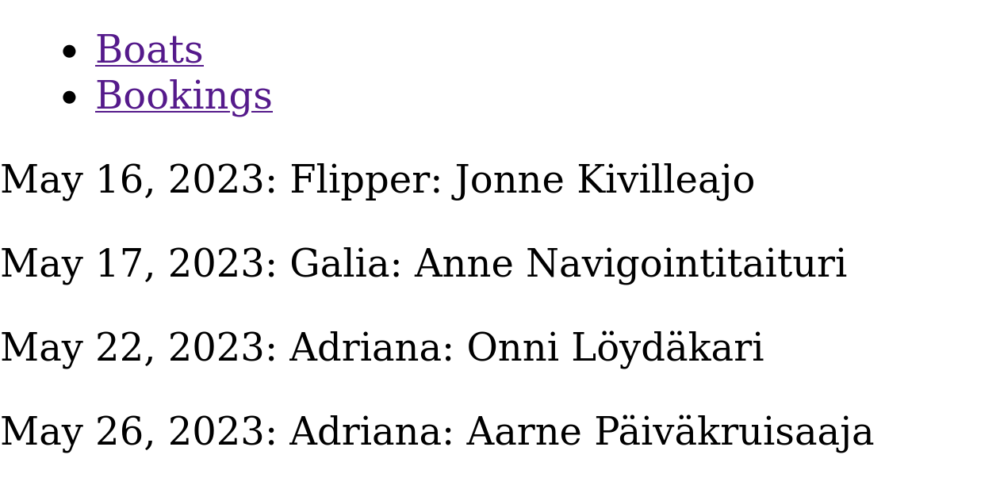
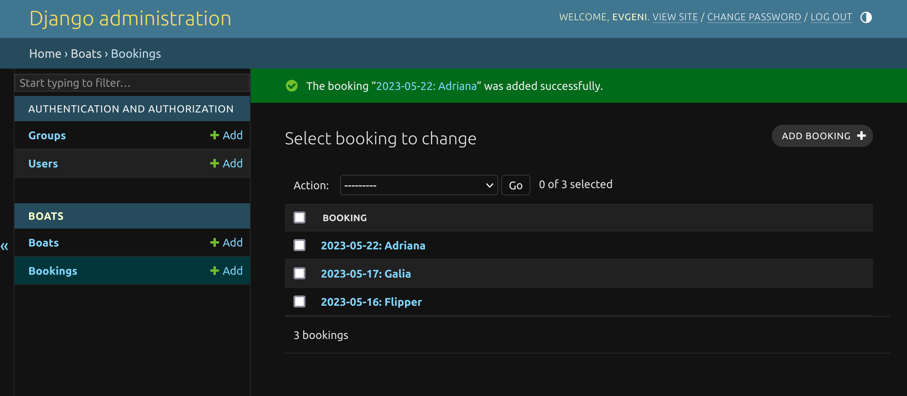

# Kotitehtävä h3

> a) Tee alusta lähtien uusi CRUD-ohjelma käyttäen Djangon yleisiä luokkanäkymiä (Class Based Generic Views).

Screenshotit alla:

## Main view

## Boats edit

## Boats add new

# Tunnilla 25.05.

Käsiteltiin Django ForeignKey one-to-many relaatiota.

Tehtävä pävitetty:
- Lisätty varausominaisuus
- ForeignKey on veneen id

Screenshotit:

