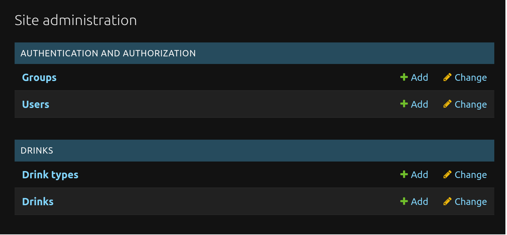
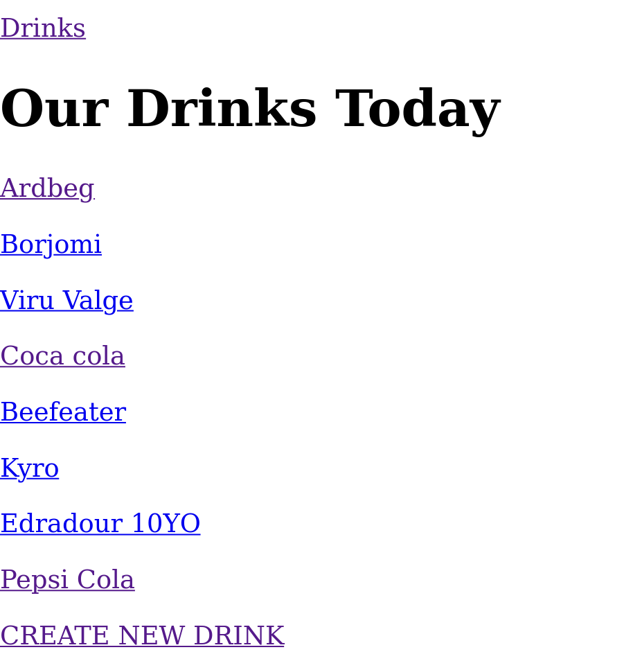
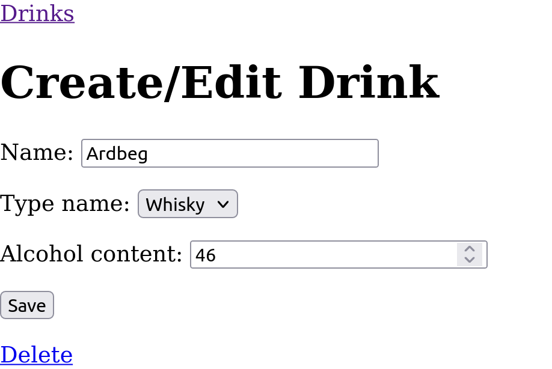

# Tehtävä 4

a) Tee alusta lähtien uusi CRUD-ohjelma, jossa on vähintään kaksi model-luokkaa (ja siten taulua) sekä niiden välillä riippuvuus (ForeignKey). Kokeile, että riippuvuus toimi sekä automaattisessa hallintaliittymässä (Django admin) että itse muoteilla tekemilläsi sivuilla.

Ohjelma ohessa.

Screenshotit:

## Admin view

## Etusivu

## Etusivu

## models.py

    from django.db import models

    class DrinkType(models.Model):
        type_name = models.CharField(max_length=50, unique=True)

        def __str__(self):
            return self.type_name
            
    class Drink(models.Model):
        name = models.CharField(max_length=160)
        type_name = models.ForeignKey(DrinkType, on_delete=models.CASCADE)
        alcohol_content = models.IntegerField(default=0)

        def __str__(self):
            return self.name
